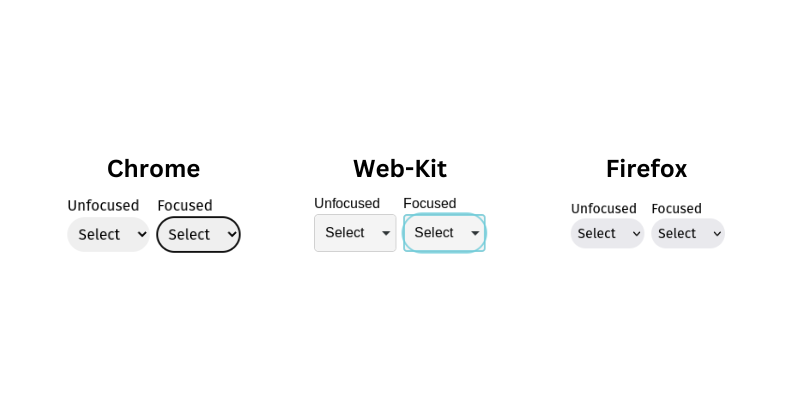

# How to style a `<select/>` tag the easy way.

<!--toc:start-->

- [Problem](#problem)
- [The Hard Way](#the-hard-way)
<!--toc:end-->

## Problem

Form controls are notoriously difficult to style, this is especially true with the `<select/>` tag. Between the browsers Firefox respects your style choices the most, followed by Chrome, then Web-kit. The results can be seen below.

As you can see above Web-kit in particular is a mess.

And if you want to style/remove elements inside the select box you can forget about it. WYSIWYG.

## The Hard Way

We have a couple of options here.

1. Build a custom select component from scratch.
2. Import a custom select component from a library.

### Build your own

If you need absolute control over all parts of your select component, then building from scratch is the way to go. This CSS-Tricks [article](https://css-tricks.com/striking-a-balance-between-native-and-custom-select-elements/) is an excellent resource if you want to go that route.

The drawback to this approach is that building your own is not trivial, especially if you plan on making it responsive.

### Import from a Library

If you go this route you can save lots of time. If it's a popular library you benefit from experienced UI designers and A/B testing. One popular option is [Material UI](https://mui.com/material-ui/react-select/).

One of the drawbacks is that you're at the mercy of the maintainer. You will also have to take the time to learn the library's API. The component might not fit exactly with your existing styling and it can be difficult to customize. You also could be shipping lots of unnecessary code.

And if you want to style/remove elements inside the style box you can forget about it. WYSIWYG.
